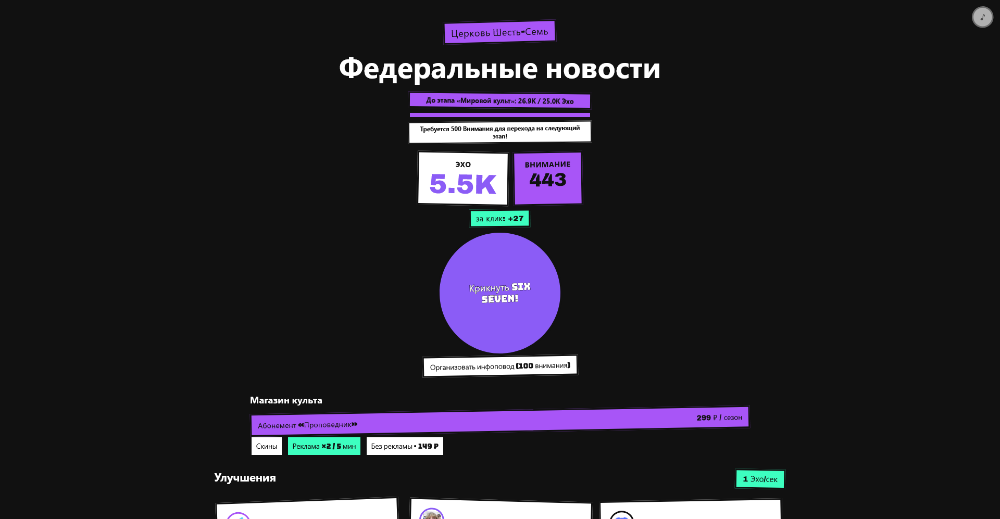
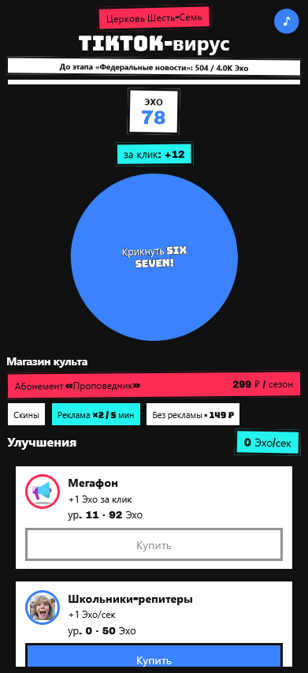
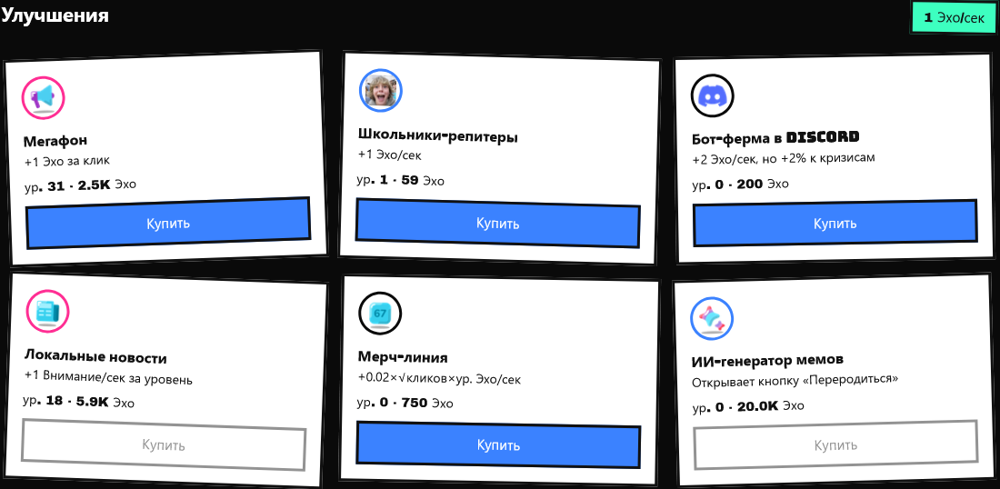

# Церковь Шесть-Семь — кликер-тайкун

Мемный кликер про культ вокруг фразы «6-7»: кликаешь, копишь **Эхо**, покупаешь улучшения, переживаешь случайные события и ведёшь культ от школьного двора до числовой сингулярности.


## Запуск

```bash
npm run install:all   # один раз
npm run dev           # клиент + сервер
```

| Сервис | URL                              |
| ------ | -------------------------------- |
| Клиент | http://localhost:5173            |
| Сервер | http://localhost:3001            |
| Health | http://localhost:3001/api/health |

Запросы с клиента на `/api/*` проксируются на сервер через Vite (`client/vite.config.js`).

Сборка клиента: `npm run build --prefix client`. Продакшен-сервер: `npm start --prefix server`.

## Демо на GitHub Pages

**Live:** https://sspabloss.github.io/six-seven-clicker/

GitHub Pages раздаёт только статику — без Express-сервера. На Pages сохранения идут в **localStorage** браузера (офлайн-доход тоже считается на клиенте). Локально с `npm run dev` по-прежнему работает серверный API.

## Core loop

1. Жмёшь **«Крикнуть Six Seven!»** — получаешь Эхо за клик (мегафон увеличивает прирост).
2. Покупаешь улучшения — растёт пассивный доход, открываются механики (Внимание, риск кризисов, перерождение).
3. Раз в ~1–2 минуты прилетает случайное событие (бонус, кризис, штраф или мемный поворот).
4. Накапливаешь `lifetimeEcho` и **Внимание** — переходишь на новые этапы культа с новой темой и катсценой.
5. Прогресс автосохраняется на сервер; при возврате начисляется офлайн-доход (кап 8 ч).

## Экономика

Все константы и формулы — в `config/gameConfig.js`.

### Ресурсы

| Ресурс           | Описание                                                     |
| ---------------- | ------------------------------------------------------------ |
| **Эхо**          | основная валюта, за клик и пассивно                          |
| **Внимание**     | с этапа 3; нужно для перехода на 4+; тратится на «инфоповод» |
| **lifetimeEcho** | всего заработано за жизнь; пороги этапов                     |
| **totalClicks**  | влияет на доход мерча                                        |

### Клик

```
Эхо за клик = BASE_CLICK_VALUE + megaphone × MEGAPHONE_PER_LEVEL
            = 1 + уровень_мегафона
```

События и рекламный буст умножают итоговый доход (`getIncomeMultiplier`).

### Цены улучшений

```
цена(level) = floor(basePrice × PRICE_GROWTH^level)   // PRICE_GROWTH = 1.18
```

| Улучшение           | basePrice | Эффект                                            |
| ------------------- | --------- | ------------------------------------------------- |
| Мегафон             | 15        | +1 Эхо/клик за уровень                            |
| Школьники-репитеры  | 50        | +1 Эхо/сек                                        |
| Бот-ферма в Discord | 200       | +2 Эхо/сек; ↑ шанс кризиса                        |
| Локальные новости   | 300       | +1 Внимание/сек; открывает валюту                 |
| Мерч-линия          | 750       | `floor(sqrt(totalClicks) × 0.02 × level)` Эхо/сек |
| ИИ-генератор мемов  | 20000     | открывает перерождение                            |

### Пассивный тик

Раз в `TICK_MS` (1000 мс) клиент начисляет `calcEchoPerSecWithEvents(save)` Эхо.

### События

Интервал: случайно 60–120 с (`EVENT_INTERVAL_MIN_MS` … `EVENT_INTERVAL_MAX_MS`).

| Событие                | Эффект                                |
| ---------------------- | ------------------------------------- |
| Илон Маск затвитил     | ×3 доход, 60 с                        |
| Родители запретили мем | ×0.5 доход, 30 с (вес ↑ с бот-фермой) |
| Авторские права        | −10% текущего Эха                     |
| Мем 7-8                | ресурс «7-8», ×2 доход, 2 мин         |

### Этапы

| #   | Название               | Условие                           |
| --- | ---------------------- | --------------------------------- |
| 1   | Школьный двор          | старт                             |
| 2   | TikTok-вирус           | 500 lifetimeEcho                  |
| 3   | Федеральные новости    | 4000 lifetimeEcho + 200 Внимания  |
| 4   | Мировой культ          | 25000 lifetimeEcho + 500 Внимания |
| 5   | Числовая сингулярность | 1+ перерождение                   |

## Данные

**Путь:** `server/data/saves.json` (создаётся при первом запуске).

**Формат записи игрока:**

```json
{
  "playerId": "uuid",
  "echo": 0,
  "attention": 0,
  "totalClicks": 0,
  "lifetimeEcho": 0,
  "stage": 1,
  "upgrades": {
    "megaphone": 0,
    "kids": 0,
    "botfarm": 0,
    "news": 0,
    "aiGen": 0,
    "merch": 0
  },
  "rebirths": 0,
  "activeEvents": [],
  "selectedSkin": "classic",
  "lastSeenAt": "2026-01-01T00:00:00.000Z"
}
```

**API:**

- `GET /api/save/:playerId` — загрузка (+ офлайн-доход)
- `POST /api/save/:playerId` — сохранение

`playerId` генерируется на клиенте (`client/src/utils/playerId.js`) и хранится в `localStorage` только как идентификатор.

**Зона роста:** запись в JSON через очередь в памяти; при нескольких инстансах сервера нужен lock или БД.

## Монетизация (мок, без реальных платежей)

UI: блок **«Магазин культа»** — `client/src/components/MonetizationPanel.jsx`  
Константы: `config/gameConfig.js` → `MONETIZATION`, `AD_BOOST`.

| Идея                    | Где в UI                    | Как монетизировалось бы   |
| ----------------------- | --------------------------- | ------------------------- |
| Абонемент «Проповедник» | баннер → модалка «Скоро!»   | подписка (Store / Stripe) |
| Скины мегафона          | галерея, меняет цвет кнопки | IAP косметики             |
| Реклама ×2 на 5 мин     | таймер 3 с → реальный буст  | rewarded video (AdMob)    |
| «Без рекламы»           | кнопка с ценой              | разовый IAP remove-ads    |

## Структура репозитория

```
client/          — React (Vite)
  src/
    app/         — App.jsx
    components/  — UI
    hooks/       — хуки
    utils/       — утилиты, константы
    api/         — saveApi
    audio/       — звук
    styles/      — глобальные стили
server/          — Express API
config/          — gameConfig.js, toastBuilder.js
screenshots/     — скриншоты для сдачи
```

Алиасы: `@/` → `client/src/`, `@config/` → `config/`.

## Скриншоты

**Desktop (1440px)**



**Mobile (375px)**



**Событие / улучшения**



## Использование AI

При разработке использовались AI-ассистенты (**Cursor / Claude**) для:

- генерации и рефакторинга кода (React-компоненты, Express API, `gameConfig`);
- текстов катсцен, описаний событий и улучшений;
- отладки (touch-события, аудио, сохранения);
- структуры README и бэклога.

Баланс, дизайн-система и игровые механики заданы в `backlog.md`; финальные числа правились вручную в `config/gameConfig.js`.

## Чек-лист ТЗ

- [x] Один мем с сюжетом — «6-7»
- [x] Главный ресурс — Эхо
- [x] Основное действие — клик
- [x] 5+ улучшений — 6 штук
- [x] 3+ событий — 4 штуки
- [x] Хранилище — JSON на сервере
- [x] Улучшения влияют на прогресс
- [x] 2+ улучшения меняют механику — бот-ферма, новости, ИИ-генератор
- [x] Этапы развития — 5 этапов
- [x] Прогресс сохраняется после перезагрузки
- [x] 3+ идеи монетизации — 4 штуки
- [x] Desktop + mobile
